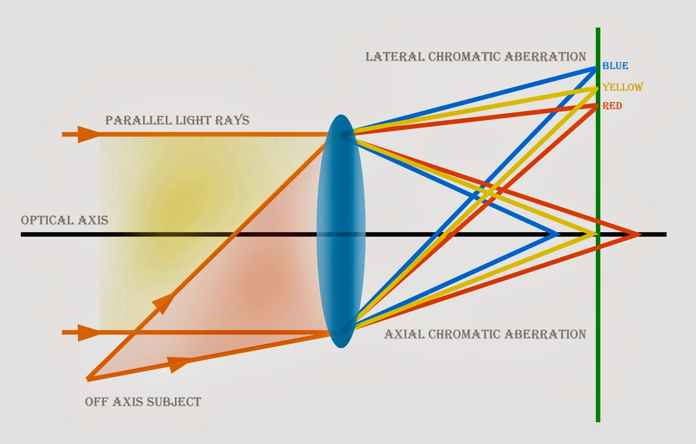

# ISP Camera Tuning Module

| Sensor problem |  |  |
| --- | --- | --- |
| Quantum efficiency (QE) | 量子效率 | 光子打到感光元件上而產生電子，這就是光電效應；光產電的效率即是量子效率。波長越常頻率越低能量越低，所以紅光比起綠藍光QE效率較低，SNR也比較差 |
|  |  |  |

| Sensor Noise type |  |
| --- | --- |
| Optical black Noise | 電子流造成，全位置的錯位，會在整個感測器上造成offset，會由沒使用到的區域回報適合裁減的數值 |
| Dark Current Noise | 由曝光時早成的熱噪產生，曝光時間越長DCN越大；導致無光時也有雜訊，且是部分區域正常、部分地方出現隨溫度上升更趨明顯的DCN，且是隨機出現不會固定出現在一個點。 |
| Defect Pixel | 壞點，固定位置的雜訊。由感測器部分點數壞掉造成，這壞掉可能由輻射、製程過程、老化造成。無論任何亮度皆固定反應，或是隨機變化不隨環境變化 |
| Fixed Noise | 固定位置的雜訊，出現在製程瑕疵或是感測器出場久了的老化導致對於光線不一致的反應 |
| Read Noise | 跟位置無關，容易出現在暗部，是將類比訊號轉換為數位時的差異，因為感測器對暗與亮的處理不會比中間區段優秀(OECF) |
| Shot Noise | 每個時間的光都無限週期，光子落在感測器上也是隨機狀態，因此造成Poisson Distribution分布的Shot noise |

| **Spatial Frequency Response**  |
| --- |
| Low: represent large, broad changes, like the overall shape of an object or a smooth gradient. |
| High:represent fine details, such as edge of object, textures, or very thin lines. |

| Slanted-edge Method |
| --- |
| 計算MTF，用斜邊法可一張圖產生一個MTF曲線
多個亮度可以拍攝能計算HDR db值的slope based |

| Chromatic Aberration |  |  |
| --- | --- | --- |
| Lateral Chromatic Aberration | 橫向色差 | 光線經過鏡頭後色散，不同色光落在不同的橫軸位置造成邊緣顏色錯位 color fringing |
| Axial Chromatic Aberration | 縱向色差 | 光線經過鏡頭後不只色散，不同色光也對焦在不同深度 |

| Noun/Unit |  |
| --- | --- |
| frame rate/fps | 幀率 |
|  |  |

[Color](https://www.notion.so/Color-23727c1a893c8083ac61f996e7673e32?pvs=21)

[Edge Enhancement](https://www.notion.so/Edge-Enhancement-23827c1a893c8009b582d6904e29c89c?pvs=21)

[HDR](https://www.notion.so/HDR-23b27c1a893c807b9474e0b88053d769?pvs=21)

[3A](https://www.notion.so/3A-23b27c1a893c80ae8fefc861952b6ab3?pvs=21)

[Trouble Shooting](https://www.notion.so/Trouble-Shooting-29327c1a893c80f0a3d7ddc5040eed37?pvs=21)

[Color Transform](https://www.notion.so/Color-Transform-31227c1a893c809db513d239a2d70840?pvs=21)

[First Frame Issue](https://www.notion.so/First-Frame-Issue-33527c1a893c806db9bed8c11e3da045?pvs=21)