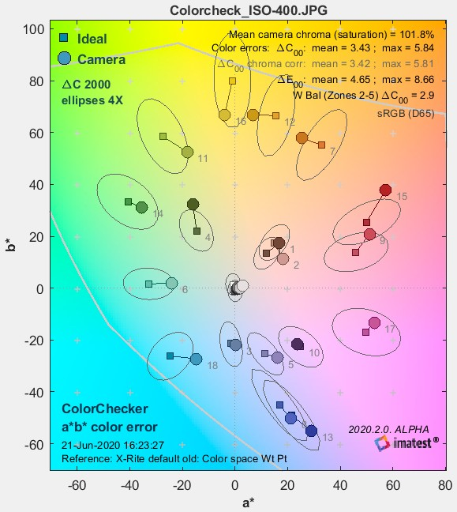

# Color

| Name | description |
| --- | --- |
| C00 | the chroma (saturation) distance in CIE2000 standard. |
| E00 | the Error Rate include Luminance, Chromiance and Chroma. |

| CFA會造成的問題 |  |
| --- | --- |
| Moire | 若畫面中有密度很高的紋路，會和sensor面板產生干涉，則無論怎麼判斷edge都無法糾錯 |
| False Color | 因為是用周圍點模擬出當前點的數值，如果source是邊緣但target不是，則會出現線段之間有不該存在的顏色。 |
| Zipper | 高對比、邊緣周圍有多色偏移，此現象稱為Aliasing。因為是將周圍的點拿來模擬自己當下的點，但跨過邊緣取點會造成平均跳動而出現色偏 |
| Maze  | 迷宮紋。會出現在低SNR的地方，因為演算法會嘗試找到相似的點來做轉換，但雜訊太重了濾波器進行過濾後，抹除感會很重，會出現一個個方塊甚至迷宮狀方方一條條的樣子 |