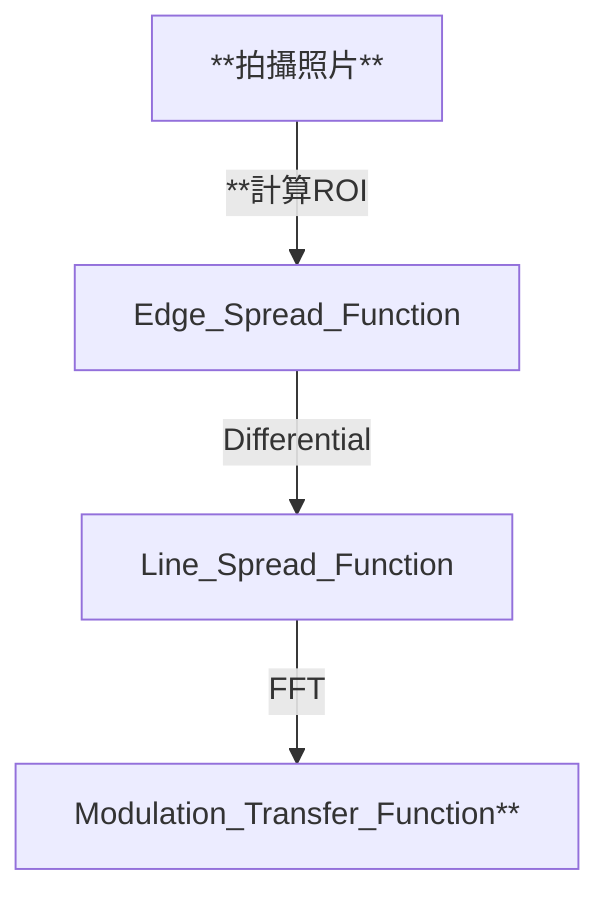

# Edge Enhancement

simple slanted-edge 

detailed slanted-edge

拍攝包含斜邊的圖像後，擷取斜邊區域（ROI），並透過 OECF（根據 ISO 14524）將影像轉為線性亮度空間。接著由 ROI 得到邊緣灰階變化曲線（Edge Spread Function, ESF），對其微分得到 Line Spread Function (LSF)。將 LSF 經 Fourier Transform 轉換為頻率域，即為 MTF 曲線，表示系統對不同空間頻率的保真能力。

After capturing an image that includes a slanted edge, the region of interest (ROI) around the edge is extracted. Using the OECF (in accordance with ISO 14524), the image is converted to a linear luminance space. From the ROI, the Edge Spread Function (ESF) is obtained, which describes the grayscale variation across the edge. By differentiating the ESF, the Line Spread Function (LSF) is derived. Applying a Fourier Transform to the LSF converts it into the frequency domain, resulting in the MTF curve, which represents the system’s fidelity in reproducing different spatial frequencies.