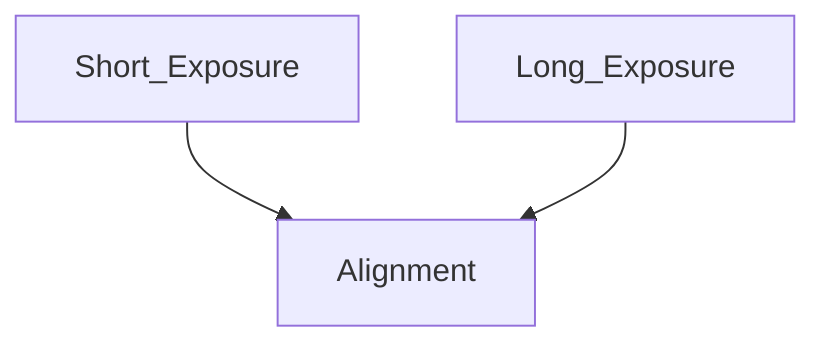

# HDR

| Source | Defetct | advantage |
| --- | --- | --- |
| DCG, Dual Conversion Gain | 因是控制DG去得到明暗畫面，會因為Gain調的極大而有放大雜訊的問題 | 抗鬼影問題
framerate不受影響 |
| ME, Multi Exposure | 鬼影
因需要傳輸兩張以上的影像，framerate會受影響 | 不會有放大某些畫面雜訊的問題 |

一般sensor已經能夠支援兩者，錄影用DCG、拍照用ME

| anti-led flicker |  |
| --- | --- |
| 感測器偵測LED存在 | SPD Split-Pixel Design: 
依照rolling shutter的運作: 逐行曝光，此時感測器可以捕捉到LED變化造成的條紋變化。
也可以不同區域做不同時間點的曝光
不管哪種做法，SPD是個將一個pixel拆為兩個做事的技術，通常一個專心做L/HCG，一個配合需求做處理，因此可以對閃爍的LED做出對應 |
| 算法偵測LED存在 | 對畫面做FFT，LED燈會有固定頻率變化
或是亮度的變化也會讓頻譜出現不同反應 |

| HDR計算法 |  |  |
| --- | --- | --- |
| Slope | 無計算Noise，僅能代表看不看的到、變化順不順 | 可以檢測HDR等fusion多個曝光值時的能力 |
| SNR | 計算Noise，能呈現畫面好不好看 | 檢測單一曝光能力、降噪能力、sensor品質 |

