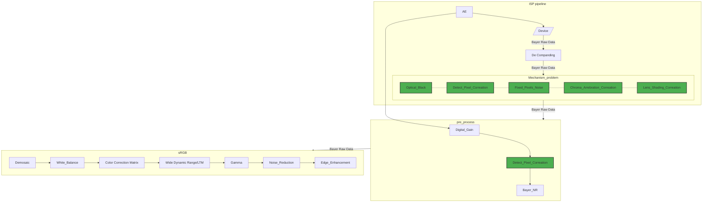

# Algorithm Strategies

```mermaid
graph TD
	subgraph ISP pipeline
		A[/"Device"/] -->|Bayer Raw Data| B["De Companding"]
		C["AE"] --> A
		B -->|Bayer Raw Data| Mechanism_problem
		end
	subgraph Mechanism_problem
				D["Optical_Black"]
				E["Detect_Pixel_Correation"]
				F["Fixed_Pixels_Noise"]
				G["Chroma_Arrebration_Correation"]
				H["Lens_Shading_Correation"]
				
				D-.-E
				E-.-F
				F-.-G
				G-.-H
		end
	style D fill:#4CAF50, stroke:#333, stroke-width:2px;
	style E fill:#4CAF50, stroke:#333, stroke-width:2px;
	style F fill:#4CAF50, stroke:#333, stroke-width:2px;
	style G fill:#4CAF50, stroke:#333, stroke-width:2px;
	style H fill:#4CAF50, stroke:#333, stroke-width:2px;	
		subgraph pre_process
				I["Digital_Gain"]-->K["Detect_Pixel_Correation"]
				C-->I
				K-->L["Bayer_NR"]

		end
	style K fill:#4CAF50, stroke:#333, stroke-width:2px;	
		Mechanism_problem-->|Bayer Raw Data|pre_process
		pre_process-->|Bayer Raw Data|sRGB
		subgraph sRGB
				M["Demosaic"]-->N["White_Balance"]
				N-->O["Color Correction Matrix"]
				O-->P["Wide Dynamic Range/LTM"]
				P-->Q["Gamma"]
				Q-->R["Noise_Reduction"]
				R-->S["Edge_Enhancement"]
		end
	
		
	
```

[Defog - Dark Channel Prior](Algorithm%20Strategies/Defog%20-%20Dark%20Channel%20Prior%20.md)

[Dithering](Algorithm%20Strategies/Dithering%20.md)